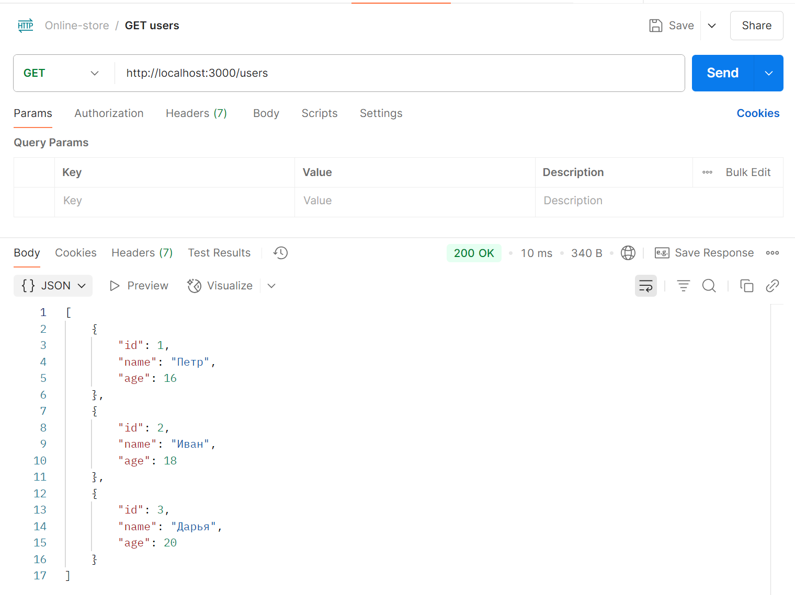
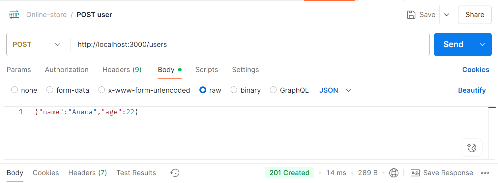
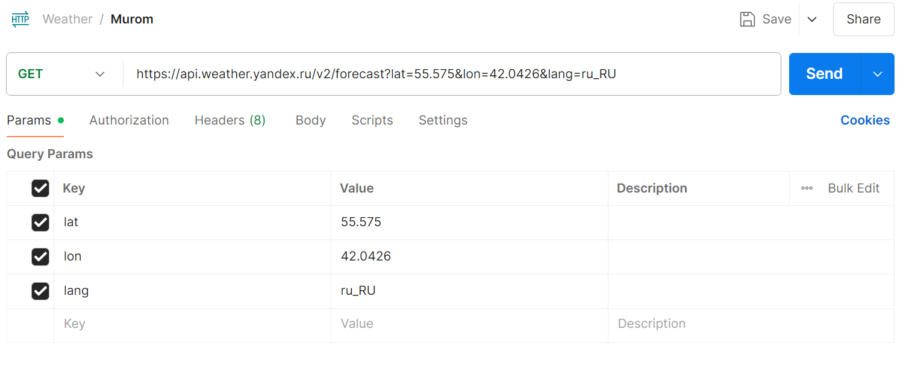
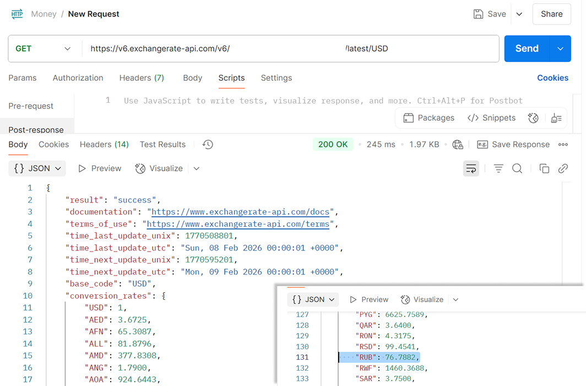

|||
|---|---|
|ДИСЦИПЛИНА|Фронтенд и бэкенд разработка|
|ИНСТИТУТ|ИПТИП|
|КАФЕДРА|Индустриального программирования|
|ВИД УЧЕБНОГО МАТЕРИАЛА|Методические указания к практическим занятиям по дисциплине|
|ПРЕПОДАВАТЕЛЬ|Загородних Николай Анатольевич<br>Краснослободцева Дарья Борисовна|
|СЕМЕСТР|4 семестр, 2025/2026 уч. год|

# Практическое занятие 3
## JSON и внешние API 

Рассмотрим работу с API, структуру и парсинг JSON. Протестируем API с помощью Postman. Решение практического задания осуществляется внутри соответствующей области, расположенной в СДО.


### Что такое JSON

**JSON (JavaScript Object Notation)** - это легкий формат обмена данными, который легко читается и генерируется как людьми, так и компьютерами.

**Структура JSON**

Данные, «упакованные» в формат JSON имеют следующий вид:

```json
{
  "name": "Иван",
  "age": 25,
  "isStudent": true,
  "courses": ["Математика", "Физика", "Информатика"],
  "address": {
    "city": "Москва",
    "street": "Ленина"
  }
}
```

JSON состоит из пар ключ-значение (наименование параметра – значение параметра). Пары разделяются между собой запятыми, а ключ отделяется от значения через двоеточие. 

Ключом может быть только строка, обёрнутая в двойные кавычки. А вот значением – почти всё что угодно:

•	Строка в двойных кавычках – "I love JSON!".

•	Число – 21.

•	Логическое значение – true.

•	Массив – [18, true, "lost", [4, 8, 15, 16, 23, 42]].

Все пары «ключ-значение» помещаются в JSON внутрь фигурных скобок.


JSON основан на JavaScript, но является независимой от языка спецификацией для данных и может использоваться почти с любым языком программирования.

JSON используется для того, чтобы получить данные от сервера. Типичная схема работы:

1.	Отправляем запрос на сервер.

2.	Ждём ответ.

3.	Получаем JSON с набором данных.

4.	Используем данные, обращаясь к ним по ключу.


Допустимые данные в JSON возможны в 2 разных форматах:

•	Набор пар «ключ-значение» в фигурных скобках {...}. Это показано в примере выше.

•	Упорядоченные списки пар «ключ-значение», разделенных запятой (,) и заключенных в квадратные скобки [...]: 

```json
[
{
  "name": "Иван",
  "age": 20,
  "isStudent": true
},
{
  "name": "Пётз",
  "age": 15,
  "isStudent": false
},
{
  "name": "Марат",
  "age": 22,
  "isStudent": true
}
]
```

В примере выше во внешних квадратных скобках заключена информация о трех людях, характеризующихся одинаковым набором параметров


Сохранять данные JSON можно в файле с расширением .json. 


## Тестирование API с помощью Postman

### Что такое Postman?

**Postman** — это популярный инструмент для тестирования API, который позволяет отправлять HTTP-запросы, проверять ответы и автоматизировать тестирование.

### Преимущества Postman

· **Удобный интерфейс** — не нужно писать curl команды вручную<br>

· **Коллекции** — организация запросов в группы<br>

· **Переменные среды** — гибкая конфигурация для разных сред<br>

· **Автоматизация** — возможность создавать тестовые сценарии<br>

· **Документация** — генерация документации API


### Установка Postman

1. **Скачайте Postman** с [официального сайта](https://www.postman.com/downloads/) или используйте веб-версию

2. **Создайте учетную запись** (бесплатно)

3. **Запустите приложение**

### Основные возможности Postman

Рассмотрим основные элементы интерфейса:

```
┌─────────────────────────────────────┐
│ 1. Workspace (Рабочее пространство) │
│ 2. Collections (Коллекции)          │
│ 3. HTTP Method (Метод запроса)      │
│ 4. URL (Адрес запроса)              │
│ 5. Headers (Заголовки)              │
│ 6. Body (Тело запроса)              │
│ 7. Tests (Тесты)                    │
└─────────────────────────────────────┘
```

### Первое тестирование 

Для наибольшей наглядности рассматриваемого материала, давайте используем простой сервер из Практического занятия 2

**server.js**
```javascript
const express = require('express');
const app = express();
const port = 3000;

let users = [
    {id: 1, name: 'Петр', age: 16},
    {id: 2, name: 'Иван', age: 18},
    {id: 3, name: 'Дарья', age: 20},
]

// Middleware для парсинга JSON
app.use(express.json());

// Главная страница
app.get('/', (req, res) => {
  res.send('Главная страница');
});

// CRUD
app.get('/users', (req, res) => {
  res.send(JSON.stringify(users));
});

app.get('/users/:id', (req, res) => {
    let user = users.find(u => u.id == req.params.id);
  res.send(JSON.stringify(user));
});

app.post('/users', (req, res) => {
  const { name, age } = req.body;

    const newUser = {
        id: Date.now(),
        name,
        age
    };

    users.push(newUser);
    res.status(201).json(newUser);
});

app.put('/users/:id', (req, res) => {
  const user = users.find(u => u.id == req.params.id);
    const { name, age } = req.body;
    if (name !== undefined) user.name = name;
    if (age !== undefined) user.age = age;

    res.json(user);
});

app.patch('/users/:id', (req, res) => {
    const userId = parseInt(req.params.id);
    const userIndex = users.findIndex(u => u.id === userId);
    
    const user = users[userIndex];
    const { name, age } = req.body;
    
    if (name !== undefined) {
        user.name = name;
    }
    if (age !== undefined) {
        user.age = age;
    }
    
    users[userIndex] = user;
    res.json(user);
});

app.delete('/users/:id', (req, res) => {
    users = users.filter(u => u.id != req.params.id);
  res.send('Ok');
});

// Запуск сервера
app.listen(port, () => {
  console.log(`Сервер запущен на http://localhost:${port}`);
});

```

> [!TIP]
> Не забывайте выполнить шаги, описанные в Практичесом занятии 2 для настройки проекта. После создания сервера запустим его с помощью команды:
> `npm run start`

### Тестирование в Postman

Наш сервер запущен и нам удалось увидеть список пользователей 

Теперь первый запрос в Postman:

1. **Создайте Workspace** → "Online-store users API"
2. **Создайте Collection** → Нажимаем "+" → Нажимаем Blank collection → Задаем название, например, "Online-store"
3. Для создания первого запроса в коллекции нажмите **"Add a request"**
4. Настройте:
   ```
   Name: GET Products
   Method: GET
   URL: http://localhost:3000/users
   ```
5. **Нажмите Send**

Если все шаги выше были выполнены корректно, то получим следующий результат:



Перед нами появятся те же значения, что были заданы ранее - отлично!

В таком же формате можем создать другой запрос и, например, добавить нового пользователя




## Работа с внешними API в Postman

Рассмотрим несколько примеров взаимодействия с внешними API с помощью Postman

### API погоды (OpenWeatherMap и Яндекс.Погода)

**Бесплатные ключи** Можно получить на официальных сайтах сервисов

> [!TIP]
> Не забудьте ознакомиться с документацией используемого API

Для примера рассмотрим реализацию запросов через данные API. Так, для взоимодействия с Яндекс.Погодй необходимо будет прописать запрос в формате, представленном на рисунке ниже



Можем видеть, что во вкладке Params отображаются прописанные в URL данные. Ключ указывается в Headers

Для OpenWeatherMap, в свою очередь, возможно указание ключа в самом запросе

**Запрос для Москвы:**
```
GET https://api.openweathermap.org/data/2.5/weather?q=Moscow&appid=ВАШ_КЛЮЧ&units=metric&lang=ru
```

**Пример ответа:**
```json
{
  "coord": {"lon": 37.6156, "lat": 55.7522},
  "weather": [
    {
      "id": 800,
      "main": "Clear",
      "description": "ясно",
      "icon": "01d"
    }
  ],
  "main": {
    "temp": 15.5,
    "feels_like": 14.8,
    "pressure": 1015,
    "humidity": 65
  },
  "name": "Moscow",
  "sys": {"country": "RU"}
}
```


### API курса валют (ExchangeRate-API)

**Бесплатный ключ:** [exchangerate-api.com](https://www.exchangerate-api.com/)

**Запрос:**
```
GET https://v6.exchangerate-api.com/v6/ВАШ_КЛЮЧ/latest/USD
```

**Пример ответа:**
```json
{
    "result": "success",
    "documentation": "https://www.exchangerate-api.com/docs",
    "terms_of_use": "https://www.exchangerate-api.com/terms",
    "time_last_update_unix": 1770508801,
    "time_last_update_utc": "Sun, 08 Feb 2026 00:00:01 +0000",
    "time_next_update_unix": 1770595201,
    "time_next_update_utc": "Mon, 09 Feb 2026 00:00:01 +0000",
    "base_code": "USD",
    "conversion_rates": {
        "USD": 1,
        "AED": 3.6725
        //.....
    }
}
```

Полный ответ можем увидеть в соответствующем окне интерфейса




> [!TIP]
> Протестируйте самостоятельно рассмотренные примеры и приложите скриншоты к отчету по проделанной работе


